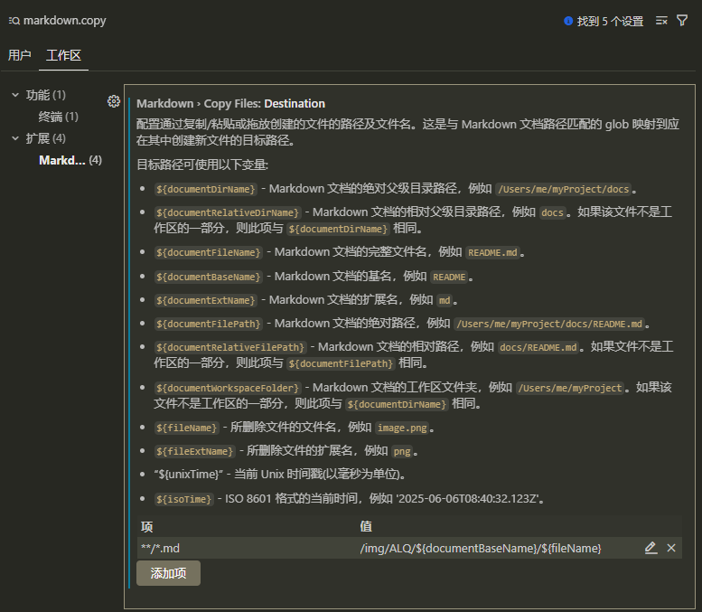

1. 在vscode中，按下`ctrl + ,`,打开设置界面。
2. 在搜索框中输入`markdown.copy`, 找到`Markdown> Copy Files:Destination`
3. 新增配置项 key 为 `**/*.md `, value 为 你的目标路径。比如我想将图片放在 img/ALQ 目录下 markdown文件同名的目录下，那么我就可以设置为 /img/ALQ/${documentBaseName}/${fileName}， 其中 ${documentBaseName} 代表markdown文件的文件名，${fileName} 代表图片的文件名。
